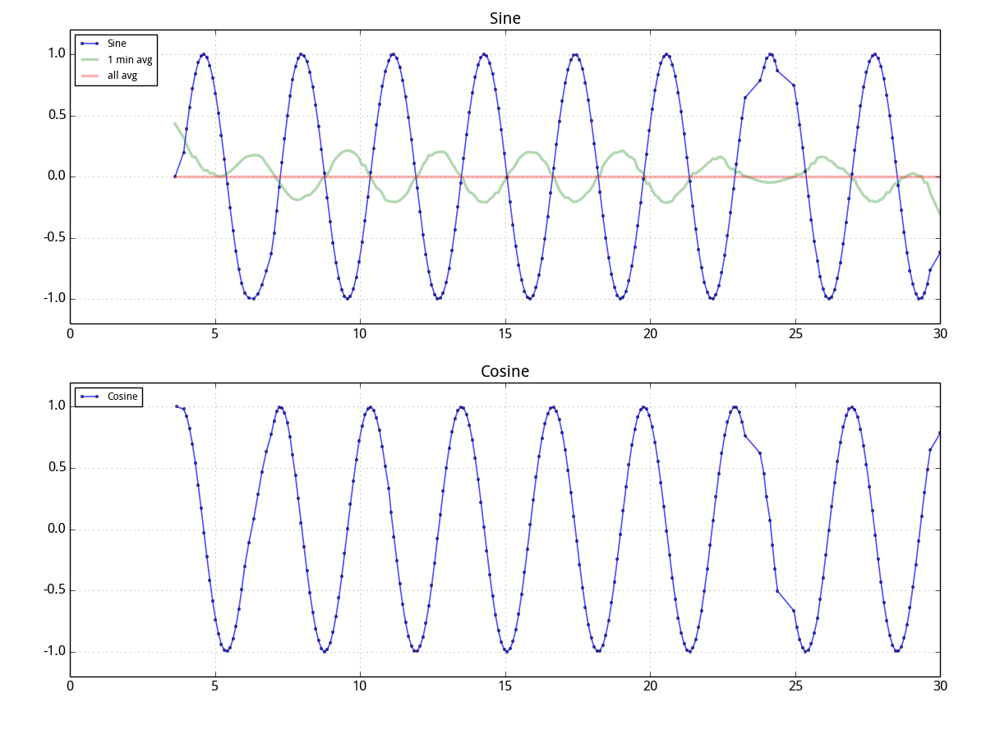

MacroBull's Python Library
===========

My python library

stlink
----
Trying to wrap stlink by ctypes
* stlink.stream: monitor a serial of specific memory addresses and stream data out, with dynamicPlot you can make a jtag-based oscilloscope

dynamicPlot
-------
Simple dynamic updating plot framework based on **matplotlib.animation**

Example:

	from numpy import sin, cos
	from macrobull.dynamicPlot import dynamicFigure, average

	df=dynamicFigure(updateInterval=100,screenLen=30)

	def update(fs):
		df.appendData([sin(fs/5.)],'Sine',211,procFunc=[lambda x,y:average(5,x,y), lambda x,y:average(0,x,y) ])
		df.appendData([cos(fs/5.)],'Cosine',212)

	df.newData=update

	df.run()
	
	

ETA
-----
A class to calculate estimate time by current progress, two different algorithms are given.

keyEvent
-----
Handle key press events for Python in terminal via termios and fcntl.

oscProcess
-----
A class , oscWave, for oscilloscope data analyze and visualization, with some signal process methods such as filters, FFT, time-value plot, Lissajous plot, merge data/channels.

Now it support models of Rigol, Tekronix and neoScope.

**oscUtility.py** is a part of oscProcess for detail signal measurement and analyze including 
signal generator, peak extractor and annotator, p-p value calculation, rise/fall Time calculation, distortion calculation.

[oscProcess/demo/examples.py](./oscProcess/demo/examples.py) gives some examples.

misc
-----
* mplTheme: Change matplotlib theme quickly
* serialChecker: Automatically choose available serial port device
* json_dict2obj: Convert parsed json dict to a JavaScript-like object.
